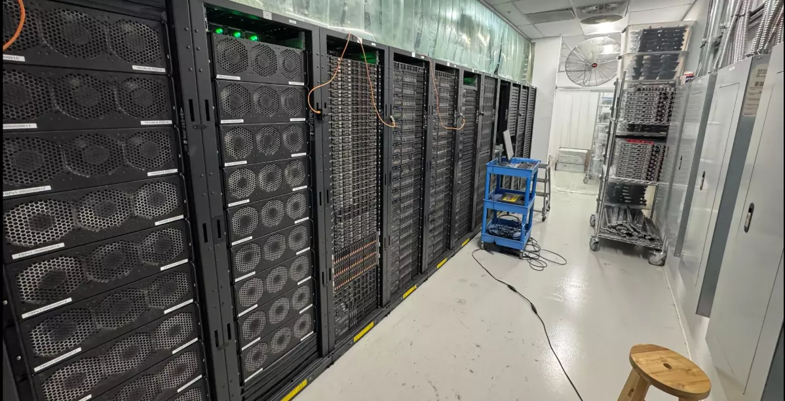

# Awesome "Build Your Own Data Center"

An awesome list of in‑depth blog posts, guides, and real‑world write‑ups on "how to build your own data center." This repo curates practical resources that cover everything from power, cooling, and physical security to networking, hardware selection, monitoring, and automation. Whether you are experimenting at home, planning a lab, or researching full‑scale facilities, these links will help you understand the concepts, trade‑offs, and best practices behind designing and running a data center.

[comma.ai](https://blog.comma.ai/datacenter/) – "Owning a $5M Data Center"

[Railway](https://blog.railway.com/p/data-center-build-part-one) – "So You Want to Build Your Own Data Center"

[Basecamp](https://basecamp.com/cloud-exit) – "we left the cloud"

[Namespace](https://namespace.so/blog/so-you-want-to-build-your-own-datacenter) – "So You Want to Build Your Own Data center"
